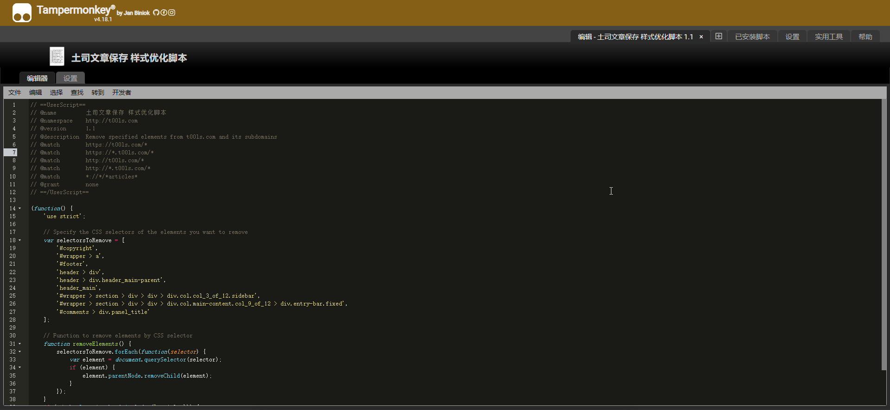
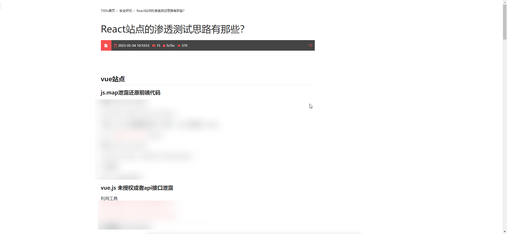
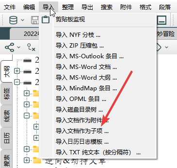

# 吐司文章净化小脚本🤷‍♂️

## 起因

看吐司时总有一些文章想保存下来 , 本身是个菜鸡不会写JS去处理 . 

我想保存文章至本地 (html页面) 我还想存储与查询 , 主力笔记软件是Mybase . 所以诞生了这个小脚本

找到了我的怨种朋友:chatGPT  

## 要求

- 只对文章帖子优化

- 浏览器带油猴

## 原理

总结了一下原理

加载页面 ---> 加载完毕 ---> 执行脚本 ---> 清除指定标签元素  (侧边栏/ 底边栏 / 顶边栏) ---> 手动保存进Mybase (自动需要mybase的插件

## 代码(js.js)



```
// ==UserScript==
// @name         土司文章保存 样式优化脚本
// @namespace    http://t00ls.com
// @version      1.1
// @description  Remove specified elements from t00ls.com and its subdomains
// @match        https://t00ls.com/*
// @match        https://*.t00ls.com/*
// @match        http://t00ls.com/*
// @match        http://*.t00ls.com/*
// @match        *://*/*articles*
// @grant        none
// ==/UserScript==

(function() {
    'use strict';

    // Specify the CSS selectors of the elements you want to remove
    var selectorsToRemove = [
        '#copyright',
        '#wrapper > a',
        '#footer',
        'header > div',
        'header > div.header_main-parent',
        'header_main',
        '#wrapper > section > div > div > div.col.col_3_of_12.sidebar',
        '#wrapper > section > div > div > div.col.main-content.col_9_of_12 > div.entry-bar.fixed',
        '#comments > div.panel_title'
    ];

    // Function to remove elements by CSS selector
    function removeElements() {
        selectorsToRemove.forEach(function(selector) {
            var element = document.querySelector(selector);
            if (element) {
                element.parentNode.removeChild(element);
            }
        });
    }
    if (window.location.href.includes('articles')) {
        // Wait for the page to load and remove the specified elements
        window.addEventListener('load', removeElements);
    }
})();
```

直接扔进**油猴**内

## 保存页面(Singlefile)


当页面处理完毕后 , 如下图 



选择singlefile去保存为本地html ( 所有资源转化为本地文件与路径 且只存在一个文件 )

## 保存笔记(mybase)

打开mybase , 选中要保存的路径 , 选中后选择导入 ,作为子项导入




## 注意事项

- 保存后mybase可能内部渲染不太行? 导致文章下面的评论看起来稍微有点乱(PS : 本地浏览器就没问题)

  解决办法:修改js脚本 , 将评论区的标签名扔进脚本